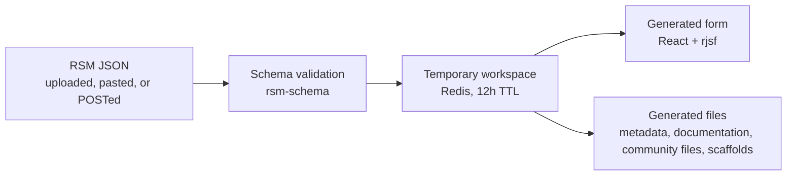

# Research Software Tools

A web application for editing Research Software Management (RSM) metadata and
generating project files or complete repository scaffolds.



Choose a guide:

- **[Using](using/index.md)** — create, edit, and export a workspace.
- **[Deployment](deployment/index.md)** — run locally or operate a production service.
- **[Developing + API](developing/index.md)** — work on the codebase, integrate with the HTTP API,
  and extend its contracts.

```{toctree}
:maxdepth: 2
:caption: Using
:hidden:

using/index
```

```{toctree}
:maxdepth: 2
:caption: Deployment
:hidden:

deployment/index
deployment/local
deployment/render
deployment/production
deployment/configuration
deployment/github
```

```{toctree}
:maxdepth: 2
:caption: Developing + API
:hidden:

developing/index
developing/api
developing/schema
developing/generators
developing/python-api
```
